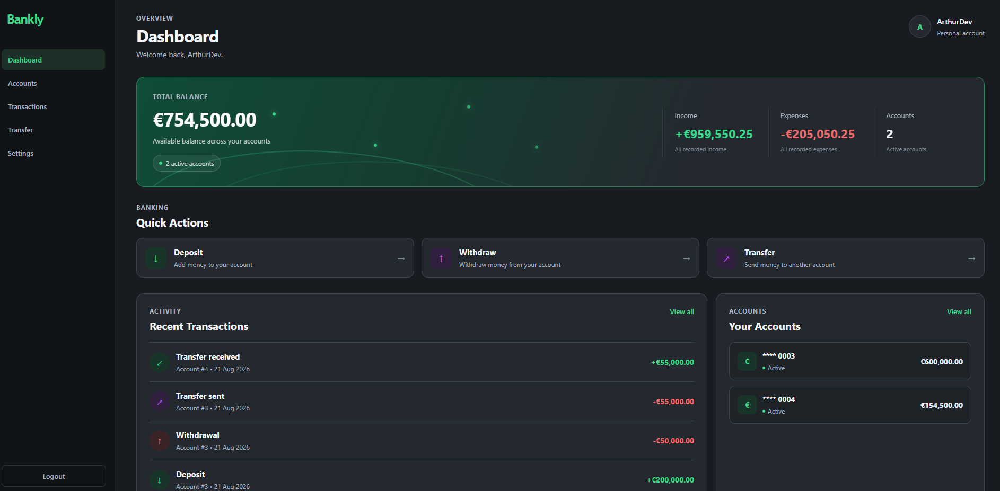
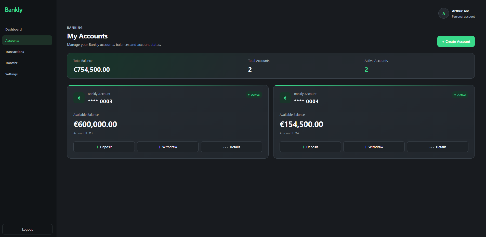
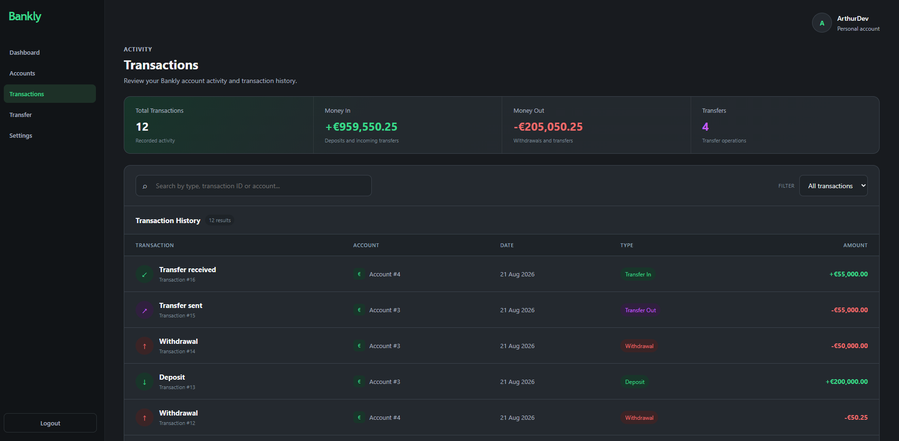
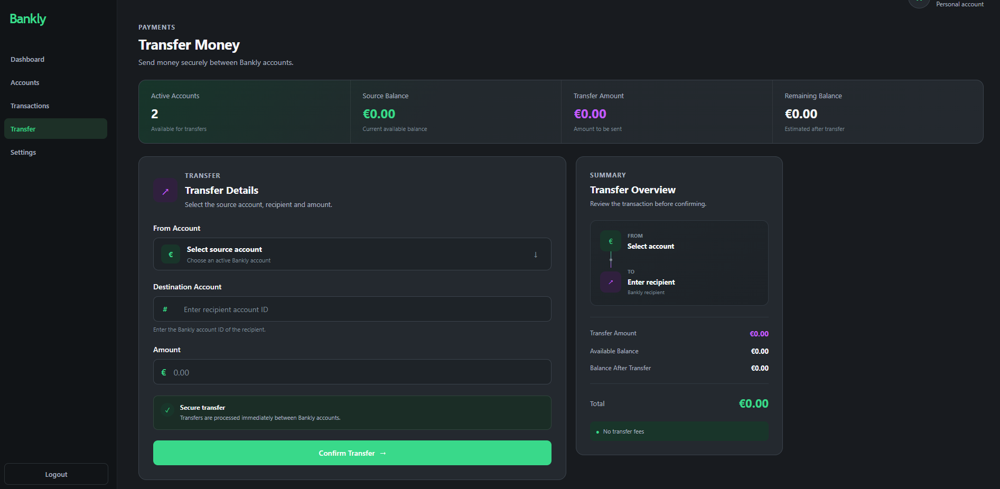
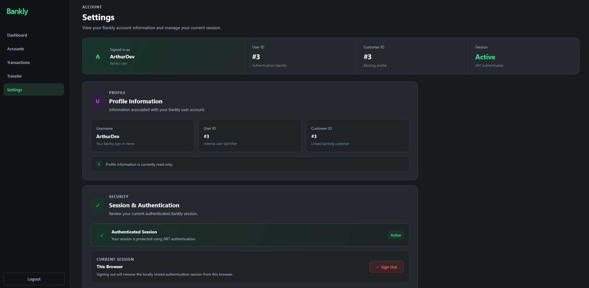

# Bankly

Bankly is a full-stack banking web application built with **ASP.NET Core, React, TypeScript, Entity Framework Core, and PostgreSQL**.

It simulates essential banking operations through a modern and responsive interface.

> **Disclaimer:** This is a personal portfolio project and is not affiliated with the company Bankly (Banking as a Service).

## Demo


## Features

- User registration and login
- JWT authentication and protected endpoints
- Bank account management
- Deposits and withdrawals
- Transfers between accounts
- Transaction history
- Financial dashboard
- Account activation and deactivation
- Responsive dark interface

## Tech Stack

**Backend**
- C#
- ASP.NET Core Web API
- Entity Framework Core
- PostgreSQL
- JWT Authentication
- Swagger / OpenAPI

**Frontend**
- React
- TypeScript
- Vite
- React Router
- CSS

## Screenshots

### Dashboard



### Accounts



### Transactions



### Transfer



### Settings



## Architecture

```text
React + TypeScript
        │
        │ HTTP / JSON
        ▼
ASP.NET Core Web API
        │
        │ Entity Framework Core
        ▼
     PostgreSQL
```

The backend handles authentication, authorization, banking rules, data validation, and persistence.

## Running Locally

### Requirements

- .NET SDK
- Node.js
- PostgreSQL

### Backend

Configure your PostgreSQL connection string and run:

```bash
dotnet ef database update
dotnet run
```

### Frontend

```bash
cd frontend
npm install
npm run dev
```

## Status

**Bankly v1.0 — Completed**

The core features planned for the first version are implemented and functional.

## Author

**Arthur Burgos**

.NET / Full-Stack Developer